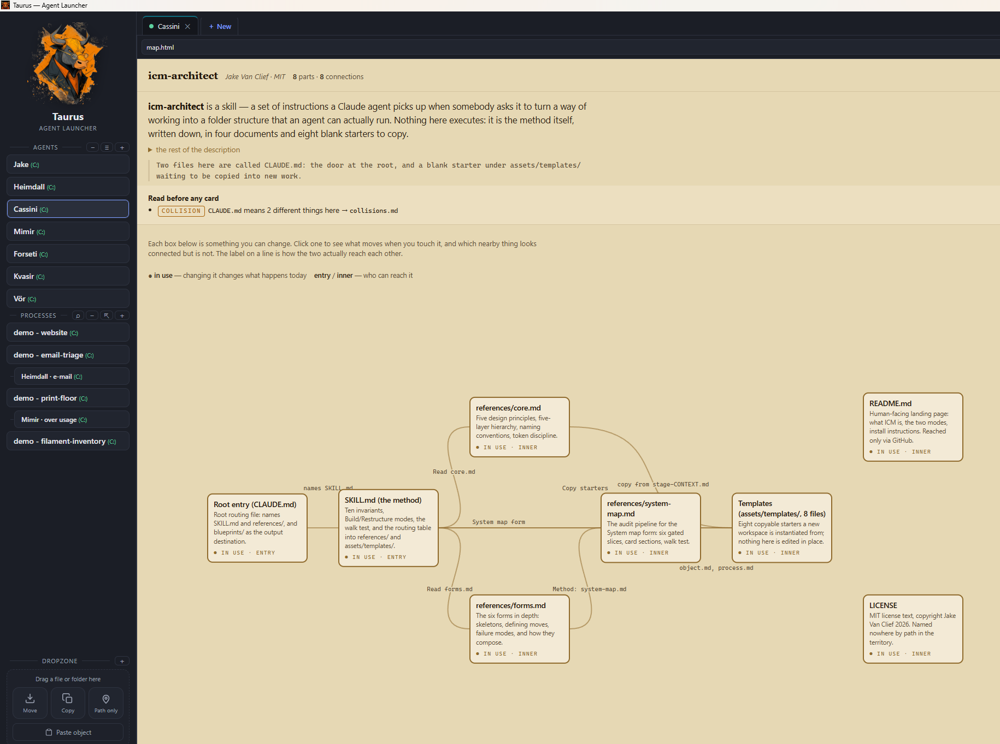

# Taurus — Agent Launcher

[](https://youtu.be/18_NHe7I2oA)

<sub>▶ Click the image to watch the **special agents** film on YouTube.</sub>

A small Tauri desktop app that runs and manages multiple **Claude Code** agents as
**terminal tabs in one window** — with voice, a file DROPZONE and an inline
HTML/Markdown viewer built in.

Since 0.5.0 a tab can also run its agent on **another machine** over SSH — your
folders stay where they are and the agent goes to them.

_▶ Watch: [remote agents](https://youtu.be/_Q_6gRCFEYc) ·
[features tour](https://www.youtube.com/watch?v=TAyZlhlvigw) ·
[original explainer](https://youtu.be/ofswaJBX39k) ·
[15-second teaser](https://youtu.be/7WDtN5giKSk)._

Pick or create an agent on the left, see the folder + a **(C:) / (X:)** drive tag,
give the session a title, choose a mode, and hit **Start** — the agent opens as an
embedded terminal tab. Open several, drag them into the order you want, and let a
tab flash in its own colour (or speak up) when an agent is done and waiting for you.

> Windows-only for now (uses ConPTY + Windows Terminal-style embedding).

## Why Taurus

Giving Claude the *right* context at the *right* moment is still one of the hardest
parts of working with coding agents day to day.

Elaborate memory systems help a single power user, but they don't scale to an
enterprise: they're hard to curate, easy to pollute, and brittle as the number of
people and projects grows. Honestly, the wheel hasn't been invented yet — nobody
has a clean, proven answer for how context should work at team scale.

Taurus is built around the **[Interpreted Context Methodology (ICM)](https://github.com/RinDig/Interpreted-Context-Methdology)** — *"folder structure as agent architecture."* Instead of orchestration code or sprawling memory, context lives in the **folders** themselves: a `CLAUDE.md`, conventions, and reference material that load in layers the moment an agent starts there. Approaches built around one person's bespoke setup are expensive to onboard a whole team onto; a folder anyone can open is not.

Taurus' contribution is the **entry point**: let everyone start the agent in the process folder they actually need. From there ICM does the rest, so:

- the **user** immediately knows *where they should be* for a given task, and
- **Claude** starts with exactly the scoped context that folder carries — giving
  repeatable results across people and runs.

It isn't the final answer to context-at-scale, but it removes the biggest piece of
day-to-day friction: people land in the right place, and the agent behaves
consistently. That's what Taurus is for.

## Features

### Agents in tabs

- **Embedded terminals with tabs** — each agent runs inside the window (xterm.js +
  ConPTY via `portable-pty`); click tabs to switch, **drag to reorder** them.
- **The AGENTS sidebar** — one-line cards with a tinted **(C:) / (X:) / (UNC)**
  drive tag so local vs network is obvious at a glance. Drag cards to reorder;
  hover for edit/delete; **＋ Add agent** on the launch form saves a one-off
  straight into the menu.
- **Attention flash + voice** — a tab flashes in its own colour only when its agent
  has *really* finished (busy detection with a confirmation window against false
  "ready" alerts), and can announce it out loud ("Porter is ready").
- **Live status** — optionally shows Claude's current activity verb on the tab
  (✶ Orbiting…).
- **Per-project agent, model & mode** — launch `claude` (Claude Code), `agy`
  (a Gemini-backed agent CLI) or `grok` (Grok Build), optionally pinned to a
  model version, in `default`, `plan` or `auto` (`--permission-mode`); all set
  per project, overridable per session.
- **Restart / resume** — right-click a tab to restart and resume the same
  conversation; optionally **remember sessions and resume them on startup**.
  (`agy` has no session ids, so a restart resumes the folder's most recent
  conversation.)
- Works with a **native `claude.exe` or an npm install** — `.cmd`/`.bat` shims
  (`npm i -g @anthropic-ai/claude-code`) are resolved and launched correctly.

### Voice

- **Talk to your agent (push-to-talk STT)** — hold **F9** or click the round
  record button above the DROPZONE; a live level ring shows *Listening…*, release
  (or click again) and the transcript lands at the active prompt (optionally sent
  immediately). Speech-to-text runs **fully offline** via a local sherpa-onnx
  sidecar (NVIDIA Parakeet TDT v3 by default, downloaded on demand from
  Settings → Voice, hash-pinned). The model list can follow a registry URL so new
  models appear without an app update.
- **Your agent talks back (TTS)** — Windows voices, including the **natural
  (neural) ones** when installed, grouped and labelled with their language
  (e.g. *Microsoft Frank — Dutch*). Optional "agent is ready" announcement for
  background tabs, speak-the-selection from a tab's context menu, and a
  slow-to-fast rate slider.

### DROPZONE

- **Hand files to your agent, locally.** Drag a file or folder onto the sidebar
  DROPZONE and pick **Move**, **Copy** (into the agent's `input/` folder) or
  **Path only**; the full path is inserted at the active prompt so you can
  immediately ask the agent to work on it. Paste works too (clipboard text, an
  image, or a file copied in Explorer), and ＋ opens a file picker. Nothing is
  ever uploaded anywhere — local files, local agent, local tools.

### Inline viewer

- **HTML preview** — click an `.html` path in the terminal (or right-click a tab →
  *HTML preview*); it renders in a sandboxed pane beside (or instead of) the
  terminal. External links open in your default browser; `mailto:` opens your
  mail client.
- **Markdown preview** — `.md` files render inline too: GFM **tables** (with
  alignment), **task lists**, strikethrough, code blocks, working in-document
  anchors — with a **`</>` raw/rendered toggle**. Rendering is escape-first
  (raw HTML in a document can never execute) and `javascript:`/`data:` links are
  stripped to plain text.

### Comfort & polish

- **Settings in tabs** (General / Theme / HTML preview / Terminal / Voice) with
  per-setting hover help.
- Search the scrollback (Ctrl+Shift+F), copy-on-select, right-click paste,
  Ctrl+Shift+C/V, clickable links, font zoom (Ctrl+= / − / 0), tab shortcuts
  (Ctrl+Tab, Ctrl+1..9, Ctrl+T/W), agent-mouse toggle — all toggleable.
- **EN / NL** — the default follows your OS language; your choice wins.
- **White-label & skins** — rebrand from a local `branding.json` and pick from ten
  visual skins. See [Branding](#branding-white-label).

## Install

Grab the latest release from the
[**releases page**](https://github.com/astetic-dev/taurus/releases):
`*-setup.exe` (installer), `.msi`, or the **portable** exe (no install).

Requirements:

- WebView2 runtime (preinstalled on Windows 11)
- The **Claude Code CLI** on your `PATH` — native installer or
  `npm install -g @anthropic-ai/claude-code` (both work)
- For dictation: a microphone + the STT model (one-time download from
  Settings → Voice, ~490 MB, stays on your machine)

## Develop

[Node.js](https://nodejs.org/) and [Rust](https://rustup.rs/) (MSVC toolchain):

```powershell
npm install
npm run tauri dev
```

## Build (installer + standalone exe)

```powershell
npm run tauri build
```

Output:
- standalone: `src-tauri/target/release/taurus.exe`
- installers: `src-tauri/target/release/bundle/` (NSIS `*-setup.exe`, MSI)

## Configuration

Projects live in `%APPDATA%\Taurus\projects.json` (per user, created on first run).
Edit them with the in-app **Agents** editor, or by hand. Format:

```json
[
  {
    "id": "my-id",
    "label": "Button name",
    "path": "C:\\path\\to\\folder",
    "title": "Default session title",
    "task": "",
    "accent": "#7c9cff",
    "mode": "default",
    "agent": "claude",
    "model": "",
    "command": ""
  }
]
```

- `agent` (optional) — which agent CLI to launch: `claude` (default, Claude Code),
  `agy` (a Gemini-backed agent CLI) or `grok` (Grok Build). Selectable per project
  in the editor and overridable per session on the launch form. Resume limitation:
  `agy` has no session ids, so restarts resume the folder's most recent
  conversation; `claude` and `grok` both resume by session id.
- `model` (optional) — model the agent starts with (free text, e.g. `opus`,
  `sonnet`, `grok-4.6`). Empty means the agent's own default. Passed as
  `--model`. An alias such as `opus` always follows the newest model in that
  line; type a full model name (`claude-opus-4-8`) to pin a version. Suggestions
  come from the aliases, from `agy models` / `grok models`, and from
  `%APPDATA%\Taurus\models.json` — a file you can edit or hand out without
  rebuilding Taurus, re-read every time the list is filled. Whatever you type
  yourself is appended to it after a successful start.
- `command` (optional) — run a different program instead of the agent for this
  project (no agent flags). Takes precedence over `agent`/`model`. Use double
  quotes around a program path or argument that contains spaces.
- A fresh install starts with an **empty** list (no baked-in paths). UI settings
  (language, font, toggles) are kept in the WebView2 local storage.

## Remote hosts

**▶ [Watch the explainer](https://youtu.be/_Q_6gRCFEYc)** — 60 seconds: adding a
machine, working on it, and moving an agent's folder structure across.

A tab can run its agent on **another machine** over SSH instead of locally: the
work happens where the data and the access are, and the tab still shows the
agent's own TUI. Hosts live in `%APPDATA%\Taurus\hosts.json` and appear in the
launch form under **Runs on**.

Add a machine once from the 🖥 button beside the Agents heading: one connection
test reports which OS it runs, whether an agent CLI is installed, whether the
box can reach `api.anthropic.com` at all, and whether a session there survives a
dropped connection. A host with [herdr](https://herdr.dev) installed gets that
last one on **Windows and macOS as well**, not just where tmux exists. An agent then carries its machine like it carries its
folder, and its tab shows a badge for where it runs.

A session on a host outlives the tab, the connection and the workstation, so **⇱
beside ＋ asks a machine what is running on it** — session, agent, its state and
its folder — and attaches to the one you pick.

Right-click a tab or an agent card to **move an agent to another machine**,
folder and all — with a survey of what is about to be copied, so a 512 MB
`node_modules` does not travel unless you say so.

Setup is two prompts — one for an agent on your workstation, one for an agent on
the target machine — in **[REMOTE-HOSTS.md](REMOTE-HOSTS.md)**, along with the
`hosts.json` format, what session persistence you get per host, and the security
notes worth reading before pointing an agent at a machine you do not own.

## Branding (white-label)

You can rebrand the launcher — app name, subtitle, logo, colours, skin, window
title — **without forking or editing code**. Copy
[`branding.example.json`](branding.example.json) to `%APPDATA%\Taurus\branding.json`
(next to `projects.json`) and edit it. Without the file the build is plain
Taurus; remove it to get Taurus back. Every field is optional:

```json
{
  "appName": "Acme Agent Launcher",
  "subtitle": "Acme Corp",
  "logo": "C:\\ProgramData\\Acme\\logo.png",
  "windowTitle": "Acme Agent Launcher",
  "skin": "default",
  "skinName": "Acme",
  "theme": { "--accent": "#3b82f6", "--bg": "#0b1220", "--bg-panel": "#11182a" }
}
```

- `theme` overrides the CSS variables in `src/styles.css` `:root` — the themeable
  ones are `--bg`, `--bg-panel`, `--bg-card`, `--bg-card-hover`, `--border`,
  `--text`, `--text-dim`, `--accent` (and `--term-bg` / `--term-fg` / `--term-sel`
  for the terminal).
- `skin` sets the **default theme** (see *Skins* below).
- `skinName` labels the branding-derived theme in the **⚙ Settings → Theme**
  dropdown (e.g. `"NEXUS"`); falls back to `appName` if omitted. Use it when your
  `subtitle` is a tagline that would read oddly as a theme name.
- `font` sets the UI font family (e.g. `"'IBM Plex Mono', monospace"`). IBM Plex
  Mono ships bundled (offline); any installed/CSS font name also works.
- `garble` (`true`/`false`) toggles the hover **letter-scramble** effect on the
  sidebar buttons, agent cards and tab titles. It's on by default for a branded
  theme; set `false` to disable.
- `logo` is an absolute path; it's read at startup and inlined as a data URI.
- The in-app branding above is runtime/config-driven. To also change the
  **installer** product name / identifier (baked into the bundle), build with a
  Tauri config overlay: `npm run tauri build -- --config <overlay>.json`.

### Skins

Built-in visual themes that restyle the sidebar, top bar, buttons and terminal.
Pick one live under **⚙ Settings → Theme**, or set a default via `"skin": "…"`
in `branding.json` (an explicit Settings choice wins). Available skins:

| value | look |
|-------|------|
| `default` | the standard dark theme |
| `retro-mac` | classic Mac System 7 / Platinum (grey, beveled, pinstripe) |
| `aqua` | early Mac OS X (pinstripes, glossy lozenge buttons) |
| `retro-win` | Windows 95/98 (teal desktop, raised 3D grey controls) |
| `winxp` | Windows XP Luna (blue bars, glossy buttons, green primary) |
| `terminal` | green-on-black CRT (monochrome, scanlines) |
| `nord` | modern — Nord arctic blue-grey (dark) |
| `dracula` | modern — Dracula (dark, vibrant) |
| `solarized` | modern — Solarized Light (warm, light) |
| `catppuccin` | modern — Catppuccin Mocha (soft pastel, dark) |

Skins are pure CSS (`src/skins.css`, scoped by `html[data-skin="…"]`) — adding
more is just another block. The retro skins adapt techniques from the MIT
projects [98.css](https://jdan.github.io/98.css/) / XP.css / system.css; the
modern skins are palette-only.

> Keep brand assets out of this repo: `branding.json` and `src/*-logo.png` are
> git-ignored. A real brand lives only in the local config, never committed.

### Portable / pre-branded distribution

`branding.json` is read from `%APPDATA%\Taurus\` **or**, as a fallback, from the
folder next to `taurus.exe`. A relative `logo` path resolves against the folder
the `branding.json` was found in. So a self-contained, pre-branded build is just
a folder you can zip and hand out:

```
MyBrand Agent Launcher/
  taurus.exe          (rename freely, e.g. "MyBrand Agent Launcher.exe")
  branding.json       ("logo": "logo.png", relative)
  logo.png
```

Unzip and run — no setup. A `branding.json` in `%APPDATA%\Taurus\` takes
precedence over the one next to the exe. To also rebrand the installer's product
name, build with a Tauri config overlay (`--config`).

## Demo mode

Want to show Taurus (or record a video) without exposing real projects?
`demo\demo-on.ps1` backs up your config and swaps in two demo agents backed by a
**fake Claude** (`mock-claude.mjs`) — no real data or MCP is ever touched.
`demo\demo-off.ps1` restores your own configuration.

## How it works

- Frontend: `src/` — vanilla HTML/CSS/JS (xterm.js vendored in `src/vendor/`).
- Backend: `src-tauri/src/lib.rs` — Rust commands for project config, the native
  folder picker, the ConPTY sessions (`create/restart/write/resize/close`), voice
  (Windows TTS + the sherpa-onnx STT sidecar) and the DROPZONE file operations.
- Previews render in a **sandboxed iframe** (no same-origin, scripts contained);
  Markdown is rendered escape-first by a small built-in renderer, so documents
  can't inject HTML/JS into the app.
