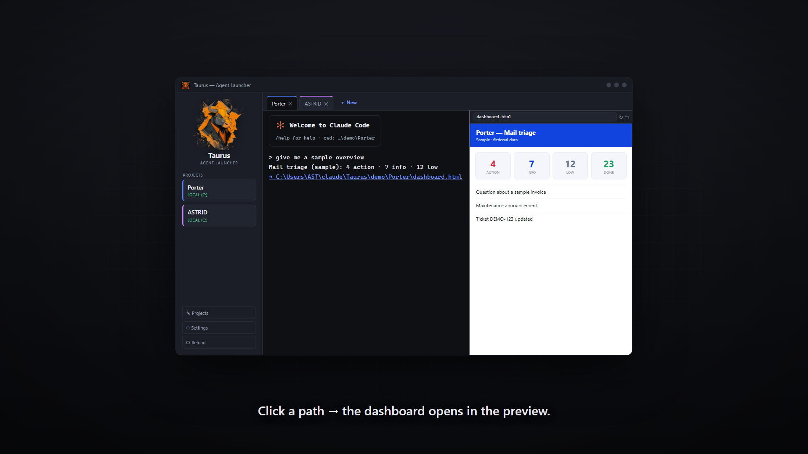

# Taurus — Agent Launcher



A small Tauri desktop app that runs and manages multiple **Claude Code** agents as
**terminal tabs in one window**.

_Intro videos: [teaser](media/taurus-teaser.mp4) · [explainer](media/taurus-explainer.mp4)._ Each agent starts in the working folder you pick,
so you never have to wonder whether you're on a local (`C:`) or network (`X:`) path.

Pick a project on the left, see the folder + a **LOCAL / NETWORK** badge, give the
session a title, choose a mode, and hit **Start** — the agent opens as an embedded
terminal tab. Open several, switch between them, and let a tab flash in its own
colour when an agent is done and waiting for you.

> Windows-only for now (uses ConPTY + Windows Terminal-style embedding).

## Why Taurus

Giving Claude the *right* context at the *right* moment is still one of the hardest
parts of working with coding agents day to day.

Elaborate memory systems help a single power user, but they don't scale to an
enterprise: they're hard to curate, easy to pollute, and brittle as the number of
people and projects grows. Honestly, the wheel hasn't been invented yet — nobody
has a clean, proven answer for how context should work at team scale.

Taurus is built around the **[Interpreted Context Methodology (ICM)](https://github.com/RinDig/Interpreted-Context-Methdology)** — *"folder structure as agent architecture."* Instead of orchestration code or sprawling memory, context lives in the **folders** themselves: a `CLAUDE.md`, conventions, and reference material that load in layers the moment an agent starts there. Approaches built around one person's bespoke setup are expensive to onboard a whole team onto; a folder anyone can open is not.

Taurus' contribution is the **entry point**: let everyone start the agent in the process folder they actually need. From there ICM does the rest, so:

- the **user** immediately knows *where they should be* for a given task, and
- **Claude** starts with exactly the scoped context that folder carries — giving
  repeatable results across people and runs.

It isn't the final answer to context-at-scale, but it removes the biggest piece of
day-to-day friction: people land in the right place, and the agent behaves
consistently. That's what Taurus is for.

## Features

- **Embedded terminals with tabs** — each agent runs inside the window (xterm.js +
  ConPTY via `portable-pty`); click tabs to switch.
- **Attention flash** — a tab flashes in its own colour only when its agent has
  finished and is waiting for input (a working agent shows a steady green dot).
- **Live status** — optionally shows Claude's current activity verb on the tab.
- **In-app project editor** — add/edit/remove launch buttons (name, folder with a
  browse dialog, colour, default title/task, mode).
- **Per-project mode** — start in `default`, `plan` or `auto` (`--permission-mode`).
- **Inline HTML preview** — right-click a tab → *HTML preview*, or click an `.html`
  path in the terminal; it renders beside (or instead of) the terminal.
- **Restart / resume** — right-click a tab to restart the session and resume the
  same conversation (handy after updating an MCP server).
- **Open folder in Explorer**, **search** (Ctrl+Shift+F), **copy/paste**, font zoom
  (Ctrl+= / - / 0), tab shortcuts (Ctrl+Tab, Ctrl+1..9, Ctrl+T/W) — all toggleable.
- **EN / NL** language switch.

## Requirements

- [Node.js](https://nodejs.org/) and [Rust](https://rustup.rs/) (MSVC toolchain)
- WebView2 runtime (preinstalled on Windows 11)
- Windows Terminal (`wt`) — optional
- The **Claude Code CLI** (`claude.exe`) available on your `PATH`

## Develop

```powershell
npm install
npm run tauri dev
```

## Build (installer + standalone exe)

```powershell
npm run tauri build
```

Output:
- standalone: `src-tauri/target/release/taurus.exe`
- installers: `src-tauri/target/release/bundle/` (NSIS `*-setup.exe`, MSI)

## Configuration

Projects live in `%APPDATA%\Taurus\projects.json` (per user, created on first run).
Edit them with the in-app **Projects** editor, or by hand. Format:

```json
[
  {
    "id": "my-id",
    "label": "Button name",
    "path": "C:\\path\\to\\folder",
    "title": "Default session title",
    "task": "",
    "accent": "#7c9cff",
    "mode": "default",
    "command": ""
  }
]
```

- `command` (optional) — run a different program instead of `claude` for this
  project.
- A fresh install starts with an **empty** list (no baked-in paths). UI settings
  (language, font, toggles) are kept in the WebView2 local storage.

## How it works

- Frontend: `src/` — vanilla HTML/CSS/JS (xterm.js vendored in `src/vendor/`).
- Backend: `src-tauri/src/lib.rs` — Rust commands for project config, the native
  folder picker, and the ConPTY sessions (`create/restart/write/resize/close`).
